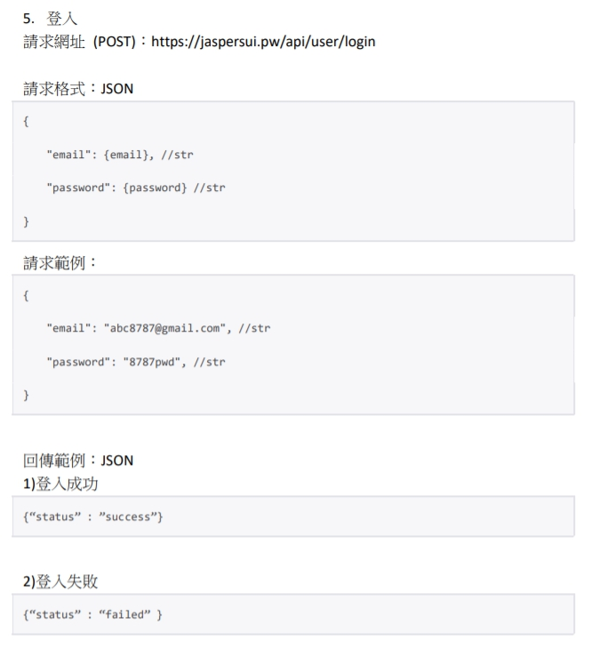

# TicTicket-DjangoRestFramework

用來作為 TicTicket 專案內的票券後台，架設在 Google Cloud Platform 機器，

使用的是 Django 團隊開發的 DRF (Django Rest Framework)，

是一個基於 Django 用來實作 Rest API 的框架，

囊括了 TicTicket App 中有關資料庫的任何操作，例如：註冊、登入、購票、儲值……等等，

並且依循 Rest 的規範來實作，同時撰寫 [API 文件](https://github.com/JasperSui/TicTicket-DjangoRestFramework/tree/master/API%20Document.pdf)，

讓協作者能夠透明詳細地知道某特定 API 會達成的目標、要求格式及回傳格式。

## 目錄

- [TicTicket-DjangoRestFramework](#TicTicket-DjangoRestFramework)
  * [目錄](#目錄)
  * [開發環境](#開發環境)
  * [接口展示](#接口展示)
    + [取得所有票種的資訊](#取得所有票種的資訊)
    + [取得特定 ID 票種的資訊](#取得特定%20ID%20票種的資訊)
    + [購票](#購票)
    + [會員註冊](#會員註冊)
    + [會員登入](#會員登入)
    + [透過 Email 取得該會員資料](#透過Email%20%20取得該會員資料)
  
開發環境
---

* [uBuntu 16.0.4 LTS](https://ubuntu.com/) 
* [Django Rest Framework](https://www.django-rest-framework.org/) 
* [MySQL](https://www.mysql.com/)
* [CloudFlare](https://www.cloudflare.com/zh-tw/)
* [Google Cloud Platform](https://cloud.google.com/)

接口展示
---
### 取得所有票種的資訊

### 取得特定 ID 票種的資訊

### 購票

### 會員註冊

### 會員登入

### 透過 Email 取得該會員資料

